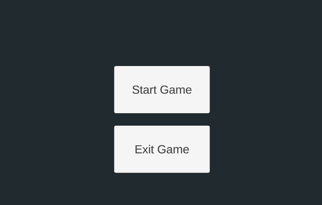
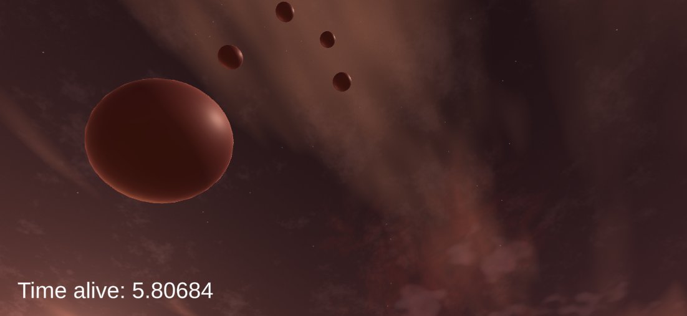
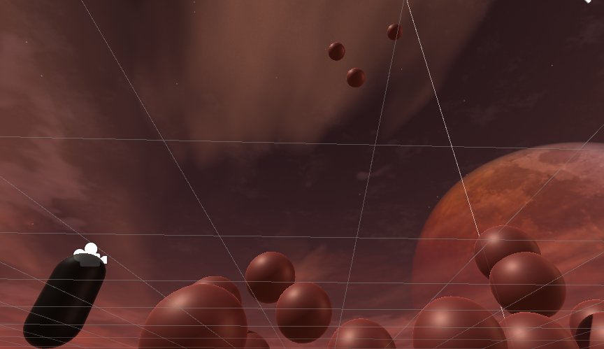
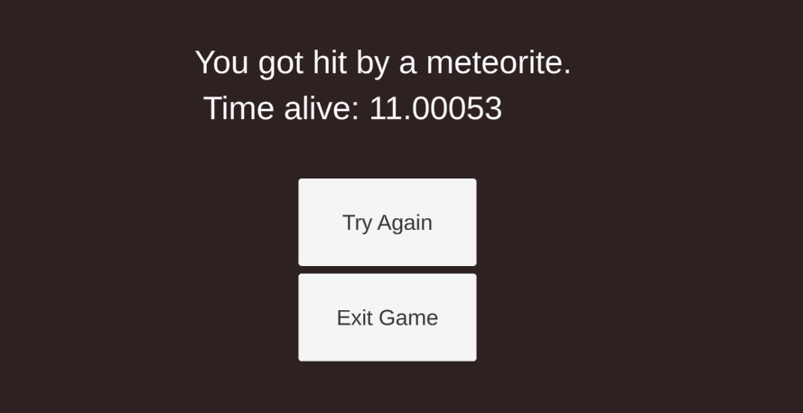

# meteorite-madness
This project is my first unity project, and was purely made for myself to test how unity works, where i made use of:
- Player movement (Looking around, sprinting, jumping)
- Randomly spawning objects
- Spawned objects automatically despawn after 5 seconds
- Game over screen when player interacts with spawned object
- Pass "timer" variable from one scene to the other
- Testing how collisions work

---

## SCREENSHOTS
\
The main menu of the game

\
\
"Meteorite" objects will randomnly spawn from the sky, these objects vanish after 5 seconds. If a player interacts with it a game over screen will appear

\
Game over screen after player has been hit by a meteorite, indicating how long the user has survived

